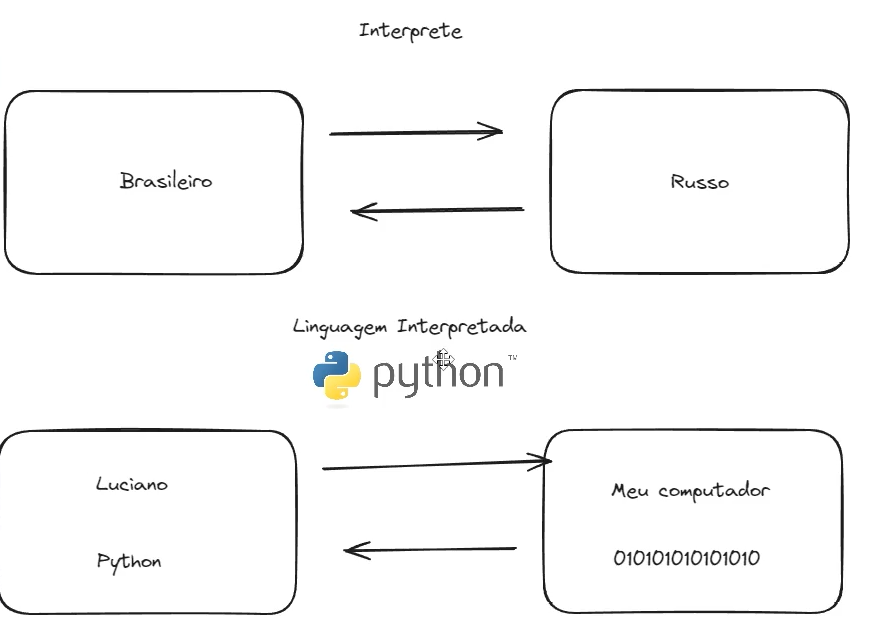
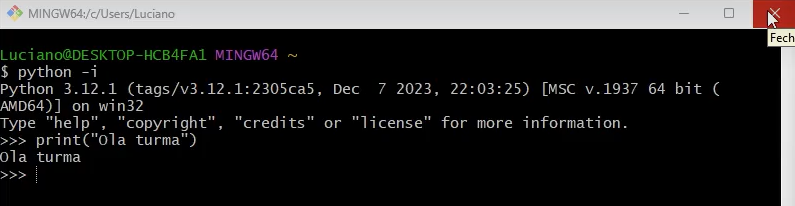
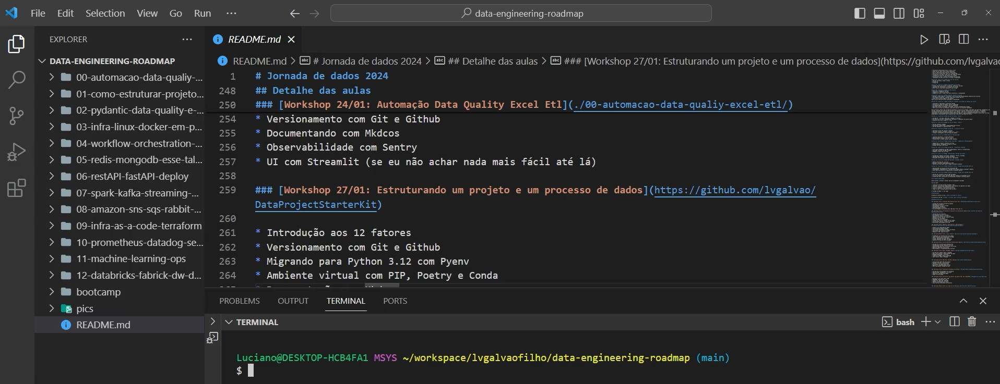
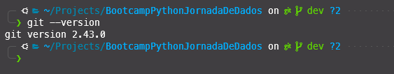

## Bootcamp de Python - Aula 01

### Objetivo
Revisar a configuração do ambiente de desenvolvimento e aprofundar sobre as instalações necessárias para o bootcamp.

### Conteúdo
- [x] Instalação do Python
- [x] Git e GitHub

### Terminal
No caso do curso usa o Git Bash, mas você pode usar o terminal padrão do seu sistema operacional.
- [x] Windows: Git Bash
- [x] Linux: Terminal padrão
- [x] Mac: Bash

Qual a vantagem do Git Bash - Ele usa o UNIX. Pois unifica os comandos para todos os sistemas operacionais.

### Instalação do Python
No terminal ao digitar o comando `python --version` ou `python3 --version` deve retornar a versão do Python instalada. Caso contrário, você deve instalar o Python.
Caso não tenha o Python instalado, você pode baixar a versão mais recente do Python no site oficial: [python.org](https://www.python.org/downloads/).

Qual o motivo de instalar o Python?
O Computador ele não entende o que você escreve, ele só entende em binário. O Python é uma linguagem de programação que traduz o que você escreve para o computador entender.



Python tem uma linguagem plural. Logo, uma das mais utilizadas. É a principal linguagem em Engenharia de Dados.
Conforme passarmos as aulas, vamos fazer download de bibliotecas. O Python já vem com algumas bibliotecas instaladas, mas existem outras:
Exemplo: Pandas, Numpy, Matplotlib, Scikit-learn, DuckDB, Spark

Para acessar diretamente o Interpretador do Python via terminal, digite o comando `python -i` e pressione Enter. Você verá um prompt interativo onde pode digitar comandos Python diretamente.



Você consegue programar em qualquer editor de texto. Mas existem editores que facilitam a sua vida. O mais utilizado é o Jupyter Notebook, mas existem outros como: VS Code, PyCharm, Spyder, Atom, Sublime Text, etc.

No curso utilizamos o...

### VS Code
O VS Code é um editor de código-fonte desenvolvido pela Microsoft. Ele é leve, rápido e possui uma grande variedade de extensões que facilitam o desenvolvimento em Python e outras linguagens.

Algumas vantagens do VS Code: 
- Leve e rápido
- Suporte a várias linguagens de programação
- Extensões para facilitar o desenvolvimento
- Integração com o Git
- Suporte a depuração
- Suporte a IntelliSense (autocompletar)
- Exploração Hierarquica de arquivos dentro do aplicativo
- Suporte a Jupyter Notebook



Para instalar o VS Code, você pode baixar a versão mais recente no site oficial: [code.visualstudio.com](https://code.visualstudio.com/).

### Git e GitHub
Git é um sistema de controle de versão distribuído que permite rastrear alterações no código-fonte ao longo do tempo. Ele é amplamente utilizado por desenvolvedores para colaborar em projetos e manter um histórico de alterações.

GitHub é uma plataforma de hospedagem de código-fonte que utiliza o Git como sistema de controle de versão. Ele permite que os desenvolvedores compartilhem e colaborem em projetos, além de fornecer recursos como rastreamento de problemas, revisões de código e integração contínua.

Para instalar o Git, você pode baixar a versão mais recente no site oficial: [git-scm.com](https://git-scm.com/).

Para verificar se o Git está instalado, você pode usar o comando `git --version` no terminal. Se o Git estiver instalado corretamente, você verá a versão instalada.



Ao finalizar a instalação do Git. Tens que configurar o seu nome e e-mail. Para isso, você pode usar os seguintes comandos no terminal:

```bash
git config --global user.name "Seu Nome"
git config --global user.email "seuemail@example.com"
```
Também é importante criar uma conta no GitHub para poder hospedar seus projetos. Você pode se inscrever gratuitamente no site oficial: [github.com](https://github.com/).

É importante ter o seu Github, pois ele é o seu portfólio. Você pode colocar os projetos que você fez e compartilhar com outras pessoas. Além disso, você pode contribuir com projetos de outras pessoas.

Para ver mais detalhes sobre o ambiente de configuração usado no curso assista o video abaixo:

[](https://www.youtube.com/watch?v=-M4pMd2yQOM&)

## Criação de Repositório no GitHub
Podemos criar um repositório do Github diretamente pelo Terminal com coandos cli ou pela interface do Github.

Para criar um repositório via interface do Github, siga os passos abaixo:
1. Acesse o site do GitHub e faça login na sua conta.
2. Clique no botão "New" ou "Criar repositório" na página inicial.
3. Preencha o nome do repositório, descrição e escolha se deseja torná-lo público ou privado.
4. Clique no botão "Create repository" para criar o repositório.
5. Após criar o repositório, você verá uma página com instruções sobre como adicionar arquivos e fazer o primeiro commit.
6. Para adicionar arquivos ao repositório, você pode usar o comando `git add` seguido do nome do arquivo ou `git add .` para adicionar todos os arquivos.
7. Após adicionar os arquivos, faça o commit com o comando `git commit -m "Mensagem do commit"`.
8. Por fim, faça o push para o repositório remoto com o comando `git push origin main` (ou `git push origin master` dependendo da configuração do seu repositório).

### Comandos Básicos do Git
Para referencias aos comandos do github você pode acessar a documentação oficial do github: [docs.github.com](https://docs.github.com/pt/get-started/quickstart/create-a-repo).

Mas vamos falar de alguns comandos básicos do Git que você vai usar no dia a dia.
```bash
git init # Inicializa um repositório Git vazio
git clone <url> # Clona um repositório remoto
git add <arquivo> # Adiciona um arquivo ao índice (staging area)
git commit -m "Mensagem do commit" # Faz um commit com uma mensagem
git status # Mostra o status do repositório
git log # Mostra o histórico de commits
git diff # Mostra as diferenças entre o índice e o último commit
git branch # Mostra as branches do repositório
git checkout <branch> # Troca para uma branch específica
git merge <branch> # Faz o merge de uma branch na branch atual
git pull # Faz o pull das alterações do repositório remoto
git push # Faz o push das alterações para o repositório remoto
git remote add origin <url> # Adiciona um repositório remoto
git remote -v # Mostra os repositórios remotos
git fetch # Faz o fetch das alterações do repositório remoto
git reset --hard <commit> # Reseta o repositório para um commit específico
git stash # Armazena alterações não commitadas
git stash pop # Restaura as alterações armazenadas
git cherry-pick <commit> # Aplica um commit específico na branch atual
git rebase <branch> # Faz o rebase da branch atual na branch especificada
git tag <tag> # Cria uma tag no commit atual
git tag -a <tag> -m "Mensagem da tag" # Cria uma tag anotada
git show <tag> # Mostra informações sobre uma tag
git rm <arquivo> # Remove um arquivo do repositório
git mv <arquivo_antigo> <arquivo_novo> # Renomeia um arquivo
```

### Primeiros Comandos em Python

#### 1) print()
Para usar o comando print basta digitar `print("Alguma coisa")`

Repare que ao redor do nosso texto, coloquei `"o que eu quero escrever"`

Assim, eu consigo avisar ao Python que o que eu quero imprimir é um texto, uma string.

Caso eu retire o parentese, irá dar erro.
```python
print("Alguma coisa") # Isto é correto
print(Alguma coisa") # Isto é errado
print(Alguma coisa) # Isto é errado
```

##### Como lidar com erros?

O primeiro passo quando você tem algum erro é buscar no Google uma solução para ele.
Seleciona o erro, copia e cola no Google. Você vai encontrar várias soluções.

Também é possível somar operações matemáticas.
```python
print(3 + 5) # 8

# Concatenção
print("Olá" + " " + "Turma") # Olá Turma
```

Para executar o código, você pode usar o terminal do VS Code ou o terminal do seu sistema operacional.
No terminal do VS Code, você pode usar o atalho `Ctrl + Shift + P` e digitar `Python: Run Python File in Terminal` para executar o código.

```bash
python nome_do_arquivo.py
```

Para entendimento dos erros, leia a mensagem de erro que aparece no terminal. Ela geralmente indica o que está errado e onde ocorreu o erro.

#### 2) input()
O comando input é usado para receber entradas do usuário. Ele exibe uma mensagem na tela e aguarda o usuário digitar algo.

```python
nome = input("Digite seu nome: ")

```

##### Concatenando com input
```python
print("Olá " + input("Digite seu nome: ") + "!")
```

##### Exercicios

Um bom site de exercicios de Python é o ws3schools. Você pode acessar o site e praticar os exercicios de Python.
[ws3schools](https://www.w3schools.com/python/python_exercises.asp)

###### 1) Exercicio 1
Crie um programa que o usário digita o seu nome e retorna o número de caracteres.

###### 2) Exercicio 2
Crie um programa onde o usuário digite dois valores e apareça a soma.

#### 3) Declaração e Atribuição de Variáveis

Variáveis em Python são fundamentais par o desenvolvimento de programas, pois atuam como "recipientes" para armazenar dados que podem ser modificados ao longo da execução de um script. Ao contrário de algumas outras linguagens de programação, Python é dinamicamente tipada, o que significa que você não precisa declarar explicitamente o tipo de uma variável antes de usá-la. O tipo de uma variável é determinado automaticamente pelo Python no momento da atribuição de um valor.

##### Declaração e Atribuição de Variáveis
A Atribuição de um valor a uma variável é feita com o operador `=`. O nome da variável deve começar com uma letra ou um caractere de sublinhado `_`, seguido por letras, números ou sublinhados. Os nomes de variáveis são sensíveis a maiúsculas e minúsculas.

Quando cria-se uma variável, o computador aloca um espaço na memória para armazenar o valor associado a essa variável. O valor pode ser de diferentes tipos, como números inteiros, números de ponto flutuante, strings, listas, dicionários, entre outros.

```python
numero - 10
mensagem = "Olá, Mundo!"
```

No exemplo acima, `numero` é uma variável que armazena um número inteiro (`10`), enquanto `mensagem` é uma variável que armazena uma string ("`Olá, Mundo!`").

##### Tipos de Dados
Python suporta vários tipos de dados, incluindo, mas não se limitado a:

- Inteiros (`int`): Números inteiros, como `1`, `2`, `3`.
- Números de ponto flutuante (`float`): Números com casas decimais, como `3.14`, `2.5`.
- Strings (`str`): Sequências de caracteres, como `"Olá"`, `"Python"`.
- Listas (`list`): Coleções ordenadas de itens, como `[1, 2, 3]`, `["a", "b", "c"]`.
- Tuplas (`tuple`): Coleções imutáveis de itens, como `(1, 2, 3)`, `("a", "b", "c")`.
- Dicionários (`dict`): Coleções de pares chave-valor, como `{"nome": "João", "idade": 30}`.
- Booleanos (`bool`): Valores lógicos, como `True` ou `False`.

##### Nome de Variáveis

Python tem algumas regras e convenções para nomes de variáveis:
- Os nomes podem conter letras, números e sublinhados(_), mas não podem começar com um número.
- Os nomes de variáveis são case-sensitive o que signifa que `variavel`, `Variavel` e `VARIAVEL` são considerados três variáveis diferentes.
- Existem algumas palavras reservadas que não podem ser usadas como nomes de variáveis, como `if`, `else`, `while`, `for`, `def`, `class`, entre outras.
- É recomendado seguir a convesão snake_case para nomes de variáveis que consistem em mais de uma palavra como `nome_usuario`, `total_pedidos`.

##### Dinamismo e Reatribuição
Uma característica importante das variáveis em Python é a possibilidade de reatríbui-las diferentes tipos de dados:
```python
x = 100 # x é um inteiro
x = "Python" # x agora é uma string
```
Isso demonstra a tipagem dinâmica do Python, mas também destaca a importância de gerenciar tipos de dados com cuidado para evitar confusão ou erros em programas mais complexos.

##### Escopo de variáveis
O escopo de uma variável deterina onde ela é acessível dentro do código. Variáveis definidas em um bloco principal são globalmente acessíveis, enquanto variáveis definidas dentro de funções ou classes são locais a essas funções, a menos que sejam explicitamente declaradas como `global`.

###### 3) Exercicio 3
Refatore o Exercício 2 atribuindo variáveis
```python	
print(len(input('Digite seu nome: ')))
```

### Desafio do dia: Cálculo de Bônus com Entrada do Usuário
<p> Escreva um programa em Python qe solicita ao usuário para digitar o seu nome, valor de seu salário mensal e o valor do bônus que recebeu. O Programa deve, então, imprimir uma mensagem saudando o usuário pelo nome e informando o valor do salário em comparação com o bônus recebido.</p>

